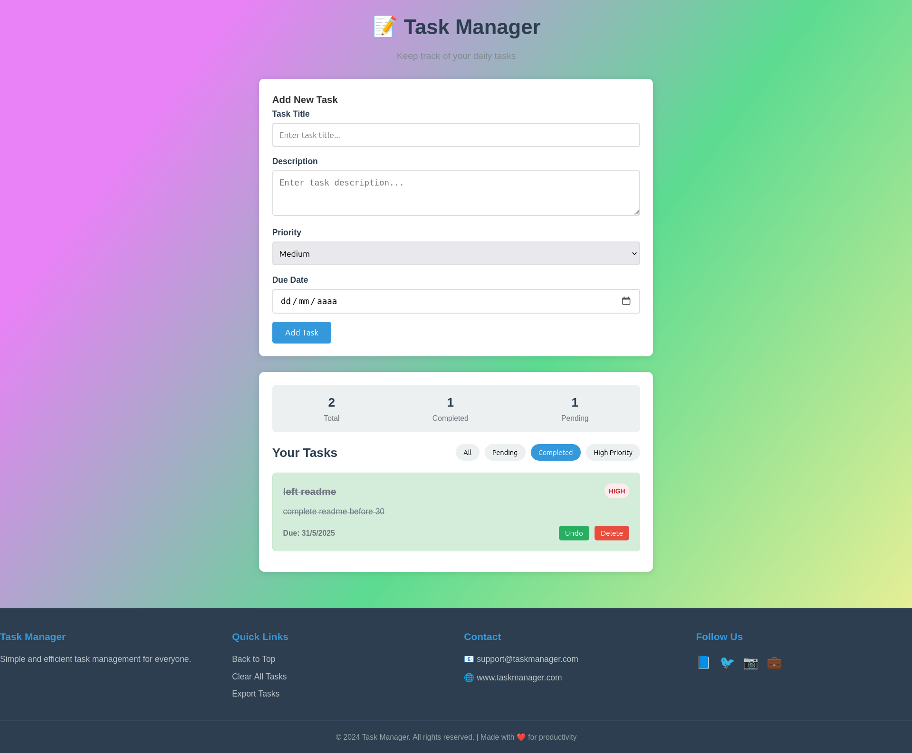

  

 
 

**Project development:**

The Task Manager is a simple web application that allows users to create, display, and delete tasks in an organized list. When a user enters a task description into the input field and clicks the "Add Task" button, the task is added to a visible list on the page. Each task includes a delete button, which the user can click to remove the task from the list. The application also uses the browser's localStorage to save tasks, meaning the list will remain intact even if the page is refreshed. This makes it a practical and user-friendly tool for managing daily to-dos directly in the browser without requiring a backend server.
 
 

## 👤 Author

Made with ❤️ by **Azalfa**
 
 

**🟦 HTML (index.html)**
 

**Purpose:**
 
 

Defines the structure of the Task Manager user interface.

*Key Elements:*

    A main container with a header titled "Task Manager".

    A form to input new tasks, consisting of:

        A text input field for task description.

        A submit button labeled "Add Task".

    A section to display the list of tasks dynamically.

 
 

**🎨 CSS (style.css)**

**Purpose:**
Provides styling for the layout and appearance of the Task Manager.

*Key Features:*

    Centered layout with padding and clean spacing.

    Styled input form and task items.

    Hover effects for interactivity.

    Simple and user-friendly design using basic colors and borders.

  
 

**⚙️ JavaScript (main.js)**

**Purpose:**
Adds interactive functionality to the Task Manager.

Functionality Includes:

    Listening to form submissions to add new tasks.

    Dynamically updating the task list in the DOM.

    Handling task deletion via button click events.

    Uses localStorage to save tasks so they persist between page reloads.